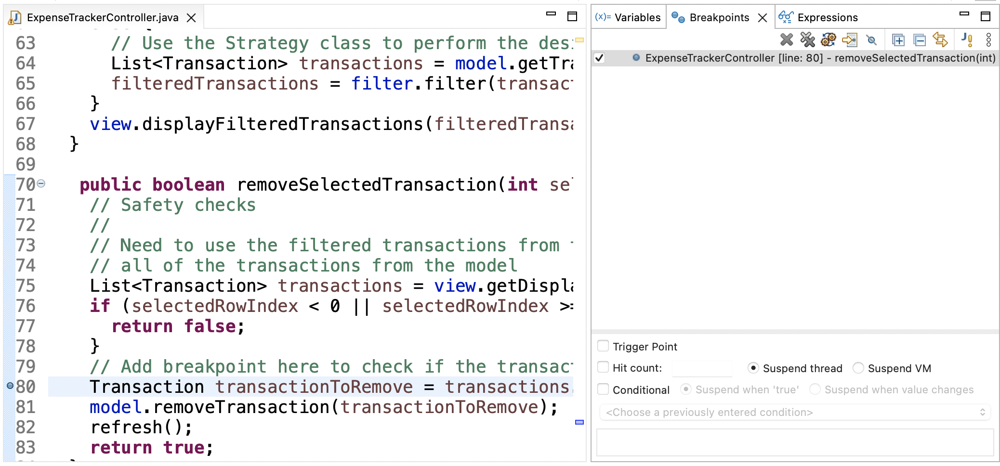
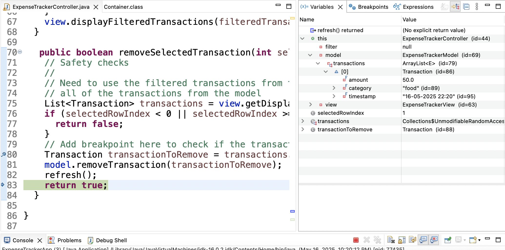

# CS520 Homework 3: Expense Tracker App

This project is a simple desktop GUI-based Expense Tracker application built using Java and Swing. It follows the **Model-View-Controller (MVC)** architecture and applies key design principles such as the **Strategy pattern** for filtering and **good UI design** through undo support.

---

##  Project Structure

- `src/` — Java source code (controller, model, view)
- `test/` — Unit tests for controller and model
- `bin/` — Output folder after compilation
- `jdoc/` — Auto-generated Javadoc files
- `build.xml` — Ant build script for compiling, testing, and documentation

---

## Getting Started

### Compile & Run (Manual)
From your terminal:
```bash
cd src
javac ExpenseTrackerApp.java
java ExpenseTrackerApp
````

You should see a GUI window appear.

### Compile & Run (with Ant)

Make sure you're in the project root (where `build.xml` is located), then:

```bash
ant clean
ant compile
ant test
ant document
```

---

##  Java Version

This project is tested with:

```
openjdk 17.0.7 2023-04-18
```

If you encounter issues, ensure you're using Java 17+.

---

## Features

### Transaction Management

* **Add Transaction**: Input amount and category, then click **"Add Transaction"**. The new transaction is shown in the table and total cost is updated.
* **Supported Categories**: `"food"`, `"travel"`, `"bills"`, `"entertainment"`, `"other"` (case-insensitive)

### Filtering (Strategy Pattern)

* **Filter by Amount**: Click **"Filter by Amount"**, enter a target amount → shows only matching transactions.
* **Filter by Category**: Click **"Filter by Category"**, enter a valid category → shows only matching transactions.
* **Clear Filter**: Removes active filters and resets table view.

### Undo Functionality (Usability Requirement)

* **Undo Transaction**: Select a transaction row from the table and click **"Remove selected transaction"** to remove it.
* **Invalid Selection**: If no valid row is selected, the user is shown an error message.

---

## Design Highlights

* **MVC Architecture**: Clean separation of logic (Model), UI (View), and control flow (Controller).
* **Strategy Pattern**: Used for extensible filtering (e.g., `AmountFilter`, `CategoryFilter`) without modifying controller logic.
* **Input Validation**: Centralized in `InputValidation.java`, used by both `Transaction` class and controller logic.
* **Undo via Controller**: Undo support is implemented at the controller level to preserve model-view separation.

---

## Testing

The test suite:

* Confirms valid and invalid transaction addition.
* Validates filtering behavior (amount and category).
* Adds a new test case for invalid undo: attempting to remove a transaction not present in the list.

Run with:

```bash
ant test
```

Make sure `lib/junit-4.11.jar` is present.

---

## Debugging

In the IDE source code editor, the debugger breakpoint is shown as a blue dot to the left of line 80 in the undo method. In the debugger, there is also the list of breakpoints (shown on the top right).



In the IDE debugger, the expense tracker model variables are being shown after adding two transactions.


In the IDE debugger, the expense tracker model variables are being shown after undoing the last transaction.



The app update status after undo:


## Documentation

To generate and view Javadoc:

```bash
ant document
```

Output is saved in the `jdoc/` folder. Open `jdoc/index.html` in your browser.

---

## Example Usage

1. Add a new transaction:
   `Amount: 50`, `Category: food` → **Add Transaction**

2. Filter by category:
   Click **"Filter by Category"** → Input: `food`

3. Undo:
   Select a row in the table → Click **"Undo"**

---

## Author & Submission

* Developed for **CS520: Software Engineering** at UMass Amherst.
* Commit history (see `git log`) documents incremental development with author, timestamp, and messages.

---

## Contact

For questions or issues, reach out via course platform or email the course staff.


